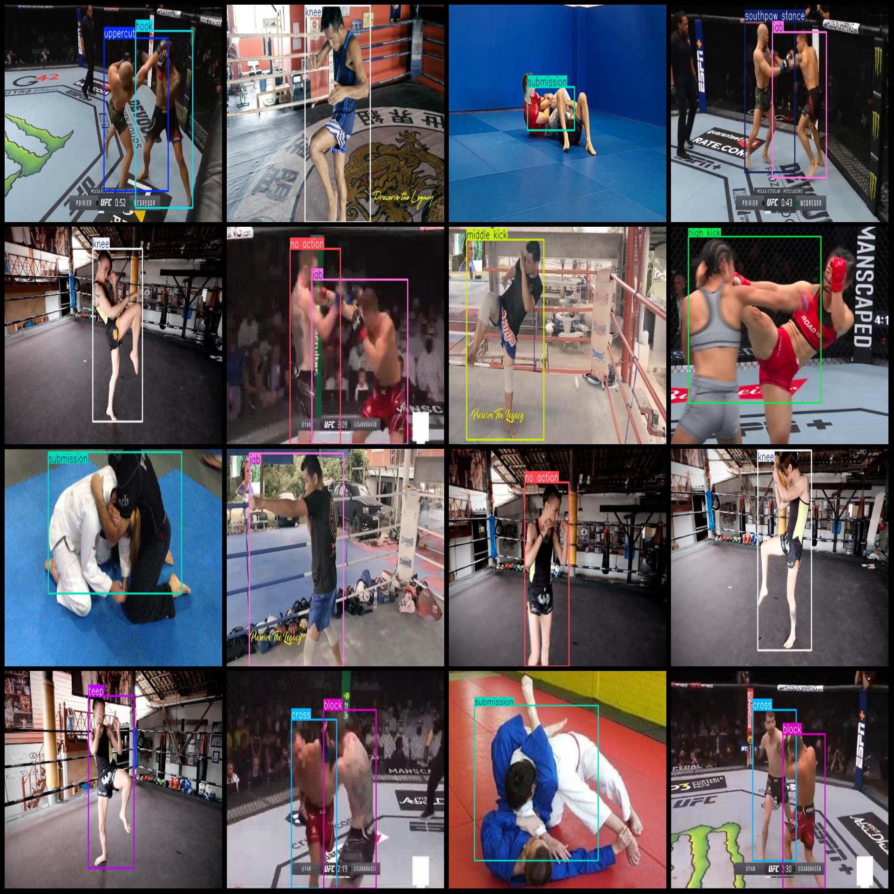
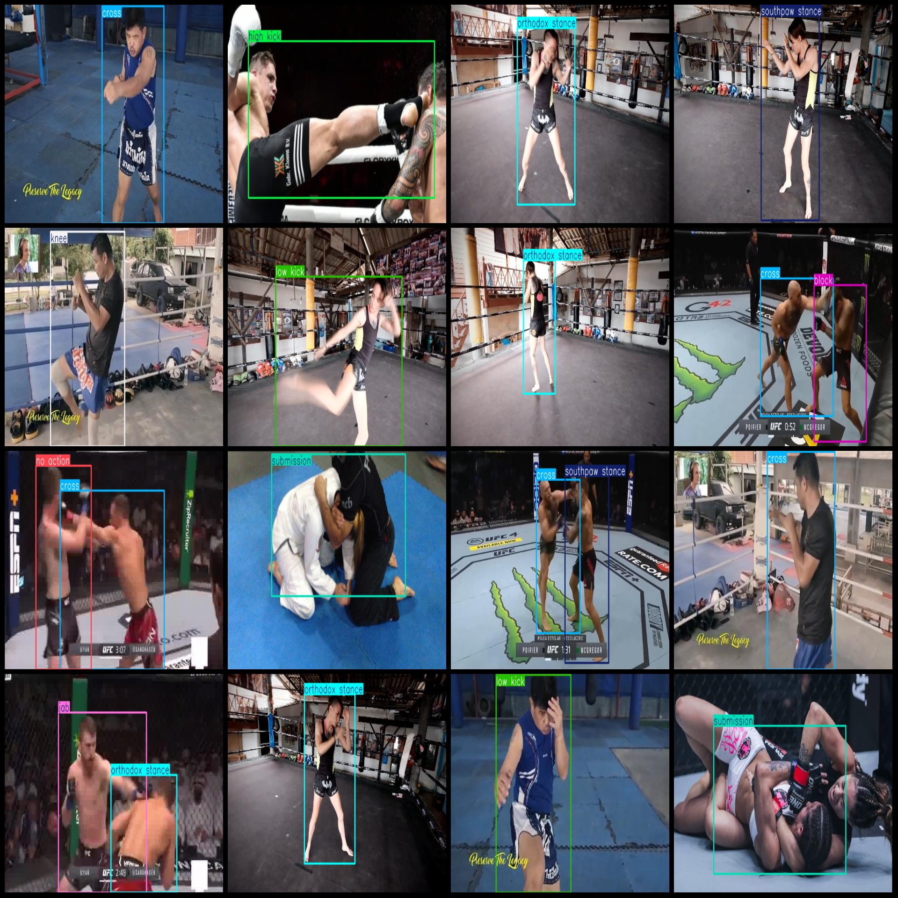

# MMA Integrated Combat Action Detection Dataset VOC + YOLO format, 1780 images, 16 categories

Dataset format: Pascal VOC format + YOLO format (without split path in txtfile, only containing jpgimage and corresponding VOC format xmlfile and yolo format txtfile)
number of images: 1780  
annotation count: 1780  
annotation count: 1780  
annotationnumber of classes: 16  
Annotation class names: ["block", "cross", "elbow", "high kick", "hook", "jab", "knee", "low kick", "middle kick", "no action", "orthodox stance", "overhand", "southpaw stance", "submission", "teep", "uppercut"]
boxes per class:   
block box count = 118
cross box count = 150
elbow box count = 40
high kick box count = 24
hook box count = 101
jab box count = 196
knee box count = 201
low kick box count = 122
Middle kick Frames = 90
No action Frames = 201
Orthodox stance Frames = 246
Overhand Frames = 15
Southpaw stance Frames = 376
Submission Frames = 252
Teep Frames = 35
Uppercut Frames = 53
Total Frames: 2220
Image Resolution: Multi-resolution images, such as 640x640, 640x360, etc.
Usage of LabelImg: labelImg
Annotation rules: Draw a rectangle box around the category
Important Notice: The dataset does not have a division of training, validation, and test sets; it needs to be divided by oneself.
Special Notice: This dataset does not guarantee the accuracy of the trained model or weight file.
Image Preview:
## Images

Here is a pay link on Stripe ( https://buy.stripe.com/3cs8yP7sY87d0vu9AB ). Please contact me lonlonago@foxmail.com after funding $89, and I will send you a complete data files , thank you!

